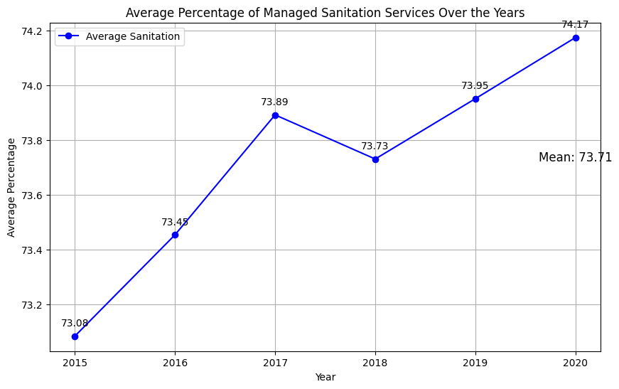
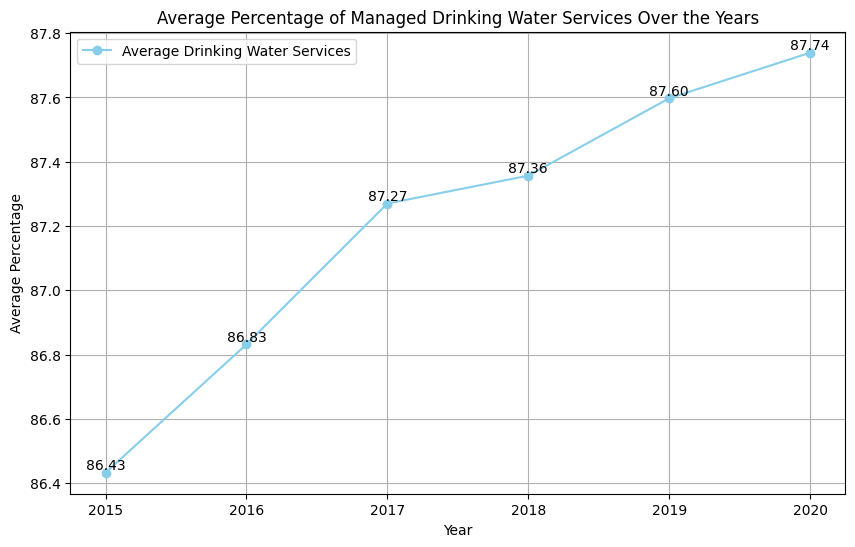
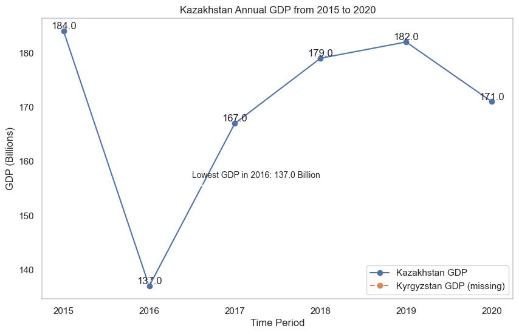
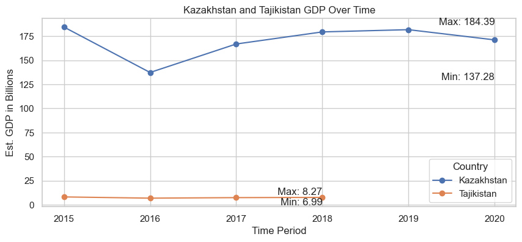

# Analyzing-Access-to-Basic-Services-and-Socioeconomic-Factors-Across-Countries-Using-SQL
This project aimed to analyze  SQL database named "access_to_basic_services in its relationship with socioeconomic indicators across different regions and countries to o eradicate poverty and ensure equal rights to basic services for all.

## Project Description
In this project, we aim to analyze a comprehensive SQL database named "access_to_basic_services." This database contains data related to access to basic services in various countries, along with key socioeconomic factors. The analysis will provide insights into the status of access to basic services and its relationship with socioeconomic indicators across different regions and countries. This project is motivated by the United Nations' Sustainable Development Goal (SDG) to eradicate poverty and ensure equal rights to basic services for all.

## Objectives
- To evaluate the current status of access to basic services, such as drinking water and sanitation, in different countries and regions.
- To investigate the relationship between access to basic services and socioeconomic factors, including GDP, land area, and unemployment rates.

## Summary Analysis through Visualisation
### Avg Magaged Samitation Services over the Years

### Avg Magaged Samitation Services over the Years

###  Kyrgyzstan GDP over time

### Kazashtan and Tajikistan GDP over time

## This project would be continued :v: